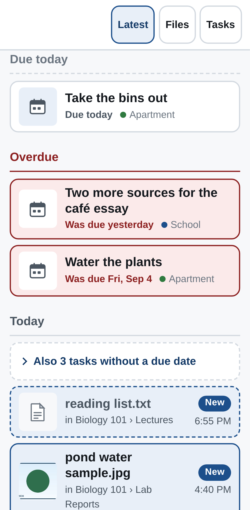
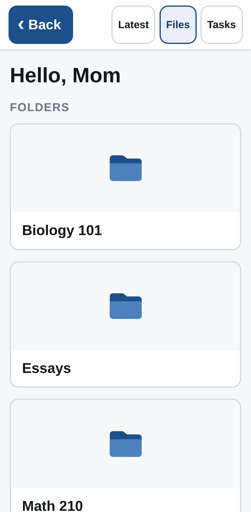
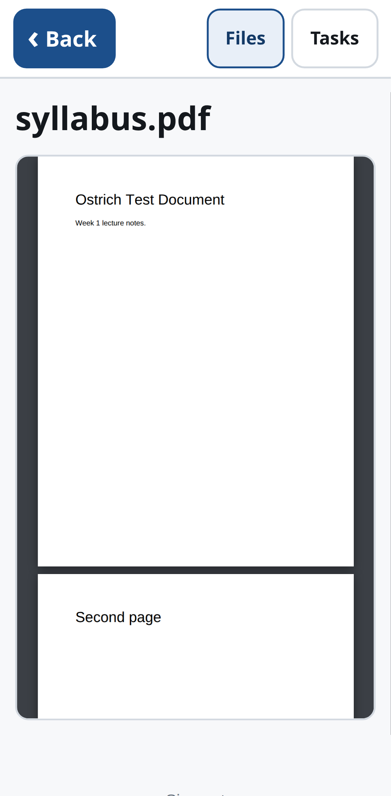
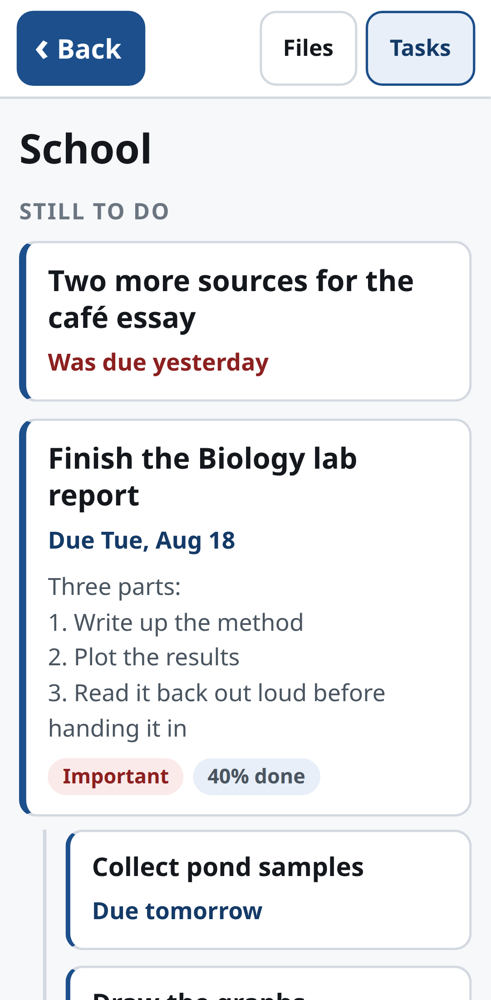
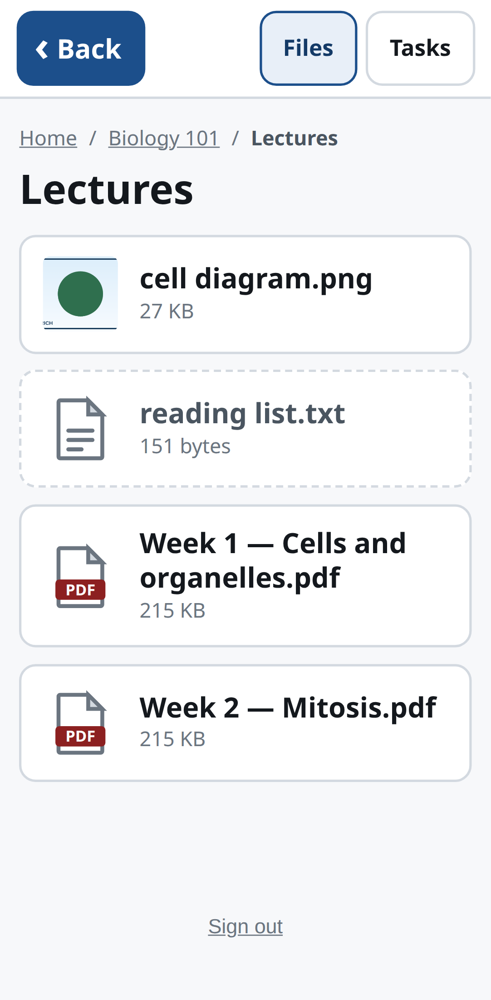
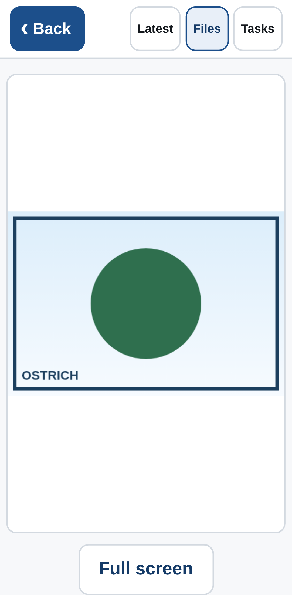
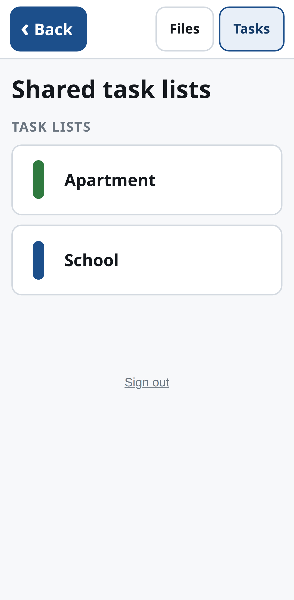
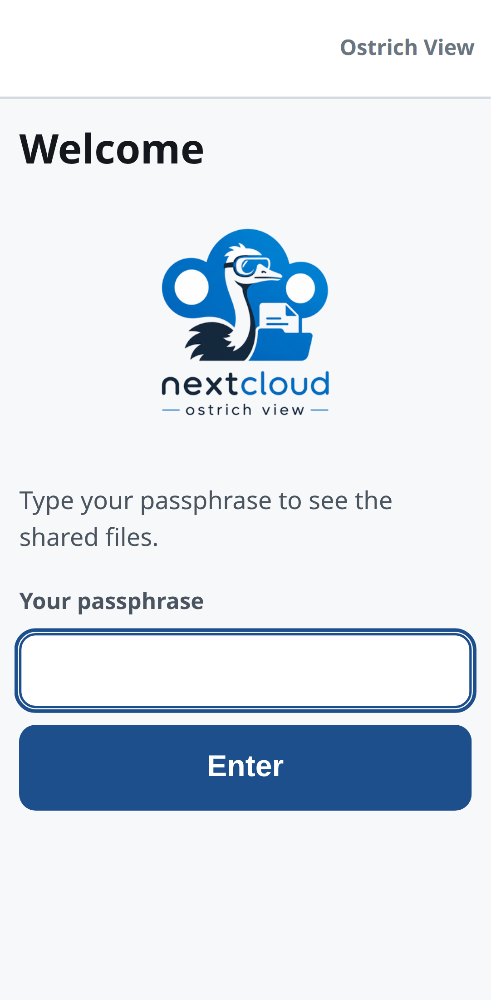
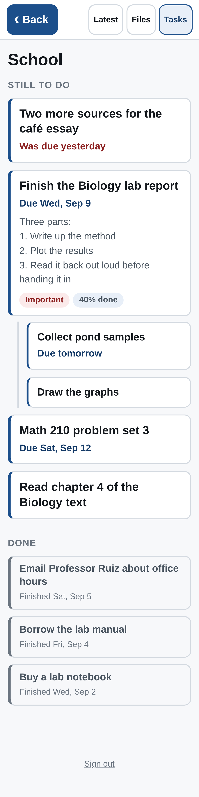

<p align="center">
  <picture>
    <source media="(prefers-color-scheme: dark)" srcset="docs/logo-dark.png">
    
  </picture>
</p>

<h1 align="center">Nextcloud Ostrich View</h1>

<p align="center">
  <em>Keep up with something going on with read-only access and no idea how anything works.</em>
</p>

## What this is

A tiny, read-only web app that shows the files and to-do lists that have been
**shared to one dedicated Nextcloud account**. The owner shares a course folder or a
Tasks list with `ostrich-viewer` from the normal Nextcloud UI; whatever is
shared is what the app shows. Nothing else is reachable.

It is built for one person who does not want to learn Nextcloud:

- **One passphrase, no username.** Each passphrase maps to a named viewer.
- **Phone first.** Big buttons, one tap per step, a Back button on every page.
- **Things open in the page.** Photos and PDFs render inline; a Word document is
  converted server-side into readable text that reflows on a phone.
- **Office files can be kept.** A Word, PowerPoint, Excel or OpenDocument file
  — and a PDF — offers the original as a download, so anyone who wants the real
  layout can open it in the app that made it. Nothing else is downloadable.
- **It opens on what has changed, and what is coming.** One time axis: the
  tasks that are due (overdue ones in red) above a **Today** line, and the
  recent history of files and task changes below it, newest first, with
  anything since her last visit marked **New** — no hunting.
- **Read-only by construction.** The Nextcloud client speaks only `PROPFIND`,
  `SEARCH`, `REPORT` and `GET`; the app registers only `GET` routes plus the
  login/logout `POST`s. The viewer account's app password never reaches the
  browser.

It runs in Docker on the Beelink beside Nextcloud and is published through the
existing Cloudflare tunnel.

See `PLAN.md` for the design and the reasoning behind it. To see the app itself
without setting any of this up, `npm install && npm run demo` — §7 explains what
that gives you.

## What it looks like

Every shot below is a phone-sized capture of `npm run demo` — the real app, the
real templates, reading `demo/dataset.json` instead of a Nextcloud.

<p align="center">
  
  
  
  
</p>

<p align="center"><em>Latest · Files · a PDF, open in the page · a task list</em></p>

**Latest** is the page she lands on, and the headline. It is one time axis, and
she arrives on the **Today** line in the middle of it — from a link, from a
bookmark, from a home-screen icon or after a pull-to-refresh, with the future
above her thumb to scroll back to and the past below. Every link into the page
carries the `#today` anchor, which does the job with scripting off; the one URL
an anchor cannot answer is a plain `/` with no fragment, and `public/stream.js`
covers that and nothing else.

Above the line, the tasks that are coming up — furthest away at the top, the
soonest just above the line, and anything late in red right against it.
Directly *under* the Today heading, where she lands, a closed twisty counts the
tasks that carry no due date at all (“Also 3 tasks without a due date”);
tapping it opens them in place, as ordinary task rows. They sit there rather
than above the line because an undated task is not later — it is open now — and
because above the line is off screen on arrival. Below the line, what has
happened: files and task changes together, newest first, grouped by day, each
row naming the folder it changed in or the task list it belongs to. Tapping a
task row opens its list, which is the only place a task is shown in full.

Rows newer than her *previous* visit carry a **New** badge — nothing is ever
hidden by a timestamp, so a badge in the wrong place costs her a badge and not
the list. A task row says **Added**, **Finished** or **Changed**. *Added* means
the first time this app saw the task: usually that is when it was written, but a
task list shared today brings its old tasks with it, and those are dated the day
they reached us rather than buried a year down the page. *Changed* means the
task was edited after it appeared — renamed, re-dated, a note added —
and since the app only ever reads, it cannot say what was edited, only that
something was. **Tasks that are deleted are not shown at all**: a task list
tells us what exists, never what used to, so a deletion is indistinguishable
from a list being unshared or a lookup that failed. If the task side cannot be
read, the file history is still there and a quiet line says tasks couldn't be
checked; the page never fails because of tasks.

**Latest / Files / Tasks** sits on every page, so any section is one tap away.
Files open **in the page**, and Back is reachable from everywhere. The only
thing offered as a download is an office file or a PDF, on its own page, behind
a button she has to press.

<p align="center">
  
  
  
  
</p>

<p align="center"><em>A folder · a photo · the task lists · the one-field login</em></p>

Task lists put everything still to do first — subtasks indented under their
parent, overdue in red — then what was finished, newest first:

<p align="center">
  
</p>

---

## 1. Nextcloud-side setup

Done once, as a Nextcloud admin plus the owner. Nothing here is app-specific — it is
ordinary Nextcloud sharing.

1. **Create the viewer account.** Settings → Administration → Users → new user
   `ostrich-viewer`. Give it a real password and no admin rights. A small quota
   is fine: it never owns files, it only receives shares.

2. **Log in as `ostrich-viewer` once.** Nextcloud does not finish provisioning
   an account (skeleton files, calendar home) until its first login, and the
   app's task discovery needs the calendar home to exist. That first login is
   also what seeds `Documents`, `Photos`, `Templates` and a couple of sample
   files in the account's own storage — leave them. The app shows only what has
   been shared **with** the account, not what it happens to own, so this
   skeleton content reaches neither the Files page nor the stream (see
   `src/nextcloud/shares.js`).

   Nothing to configure for `share_folder` either. If the instance sets it —
   Nextcloud's own default is `/Shared` — received shares are mounted inside a
   folder the account owns rather than at the top of its files home. The app
   asks the OCS Share API where they actually are (`src/nextcloud/ocs.js`) and
   lists that folder as well, so the shares appear as tiles either way and the
   container folder itself does not.

3. **Generate an app password.** While logged in as `ostrich-viewer`:
   Settings → Security → *Devices & sessions* → "Create new app password", name
   it `ostrich-view`. Copy the generated password — it is shown once. This is
   `NC_APP_PASSWORD` in `.env`. The account's real password never goes in a
   config file, and this token can be revoked from that same page without
   touching the account.

4. **Share the folders.** As the owner, share each course folder with
   `ostrich-viewer` and **uncheck "Allow editing"** (older Nextcloud versions
   call it "can edit"). The app cannot write anyway, but a read-only share means
   a bug or a stolen app password still cannot change the owner's files.

5. **Share the task lists.** In the Tasks app, each list is a calendar: open
   its ⋯ menu → Share → share with `ostrich-viewer`, read-only. Shared lists
   show up under the viewer account's CalDAV home, which is what the app
   enumerates.

6. **PDF thumbnails: tick Imaginary in Nextcloud AIO.** Opening a PDF works
   without this — the inline viewer renders the file itself and never asks
   Nextcloud for a preview — but a PDF tile only gets a real thumbnail once
   something in Nextcloud can render one, and by default nothing can. On
   Nextcloud AIO (what the Beelink runs), open the AIO interface, tick
   **Imaginary** under the optional containers, then **Stop containers**
   followed by **Start containers**. That's the whole setup: AIO's entrypoint
   wires up `OC\Preview\Imaginary` and `OC\Preview\ImaginaryPDF` on every
   restart from then on.

   Do **not** follow older guides that say to add `OC\Preview\PDF` to
   `enabledPreviewProviders` by hand — that is the ImageMagick route, AIO's
   ImageMagick policy blocks PDF rasterisation anyway, and AIO rewrites that
   config on every restart regardless of what you set. See `PDF_Previews.md`
   for the full story, how to check the current state, and how to clean up a
   hand-edited config left over from that approach.

   Existing PDFs get thumbnails the first time something asks for one; run
   `occ preview:generate-all` (from the `previewgenerator` app) if you want
   them pre-rendered for everything already shared, rather than one at a time
   as she opens folders.

### Worth checking before the first deploy

- The app reaches Nextcloud over the LAN or docker network, so that hostname
  must be in Nextcloud's `trusted_domains` and must not bounce to an HTTPS
  redirect loop.
- The zone must not have a Cloudflare "Cache Everything" rule; every page here
  is per-viewer and sent `no-store`.

---

## 2. Server setup on the Beelink

Prerequisites: git, and Docker with **Compose v2** — the `docker compose`
subcommand. The standalone `docker-compose` v1 binary will not work here (the
compose file has no `version:` key, which older v1 releases reject), and
`deploy.sh` stops with a message if that is all it finds.

Also required: the two docker networks this app joins must already exist. Both
are created and owned by other compose projects on the Beelink, and
`docker-compose.yml` declares them `external: true`, so compose fails rather
than creating them itself:

```bash
docker network ls | grep -E 'proxy|nextcloud-aio'
```

- `proxy` — Caddy's network. Caddy is how traffic reaches this app, both from
  the Cloudflare tunnel and from the LAN.
- `nextcloud-aio` — Nextcloud AIO's network, so `NC_BASE_URL` can be the
  Nextcloud container name.

Then clone. Any directory works — `deploy.sh` resolves its own location — so
keep it wherever the machine's other checkouts live:

```bash
git clone <this repo> ~/git-repos/nextcloud-ostrich-view
cd ~/git-repos/nextcloud-ostrich-view
mkdir -p data
```

`data/` is the app's only writable directory — `preview-cache/` and
`state.json` live there, bind-mounted to `/app/data`. Create it **now**, before
any `docker compose` command: if Docker has to create a missing bind-mount
source itself it creates it owned by root, and the container runs as uid 1000
and cannot write to it. The container then restart-loops on `EACCES`. `data/`
must be owned by uid 1000 (`sudo chown -R 1000:1000 data` fixes it); creating
it as an ordinary uid-1000 login user gets that for free, and `./deploy.sh`
checks it on every deploy.

### 2.1 `.env`

```bash
cp .env.example .env
$EDITOR .env
```

| Variable | Required | What it is |
|---|---|---|
| `NC_BASE_URL` | yes | Where the app finds Nextcloud. **LAN or docker-network address, not the public Cloudflare hostname.** On the Beelink, where this app joins the `nextcloud-aio` network: `http://nextcloud-aio-apache:11000`. |
| `NC_USER` | yes | The dedicated viewer account, e.g. `ostrich-viewer`. |
| `NC_APP_PASSWORD` | yes | The app password from step 3 above. Not the account password. |
| `SESSION_SECRET` | yes | 64 hex characters (32 bytes). Encrypts the session cookie. |
| `PORT` | no (3000) | Port inside the container — the port Caddy proxies to, and what the health check reads. Changing it here is enough; the host debug mapping stays at `127.0.0.1:3000`. |
| `HOST` | no (`0.0.0.0`) | Bind address. The default is right for a container: it has to accept connections from Caddy on the `proxy` network, not just loopback. |
| `DATA_DIR` | no (`/app/data` in the image) | Writable runtime directory: `preview-cache/` and `state.json`. Mounted from `./data`. |
| `VIEWERS_FILE` | no (`config/viewers.json`) | Path to the viewer list. |
| `LOG_LEVEL` | no (`info`) | `trace`…`fatal`. |

`NODE_ENV` is not in `.env` — `docker-compose.yml` sets it to `production`,
which is what makes the session cookie `Secure`-only.

**Why `NC_BASE_URL` must be internal:** every preview thumbnail and every byte
of every file is proxied through this app. Pointing it at
`https://cloud.example.com` would send that traffic out to Cloudflare and
back in for no reason, on a home upload link. Use the LAN address (or a docker
container name, see below). The catch is that Nextcloud checks the `Host`
header: whatever hostname you use here has to appear in Nextcloud's
`trusted_domains` array in `config/config.php`, or Nextcloud answers with its
"untrusted domain" page instead of your files.

Generate the session secret:

```bash
openssl rand -hex 32
# or, if node is installed on the host:
node -e "console.log(require('crypto').randomBytes(32).toString('hex'))"
```

### 2.2 `config/viewers.json`

The viewer list — who can log in, and under which name "when did they last
look?" is tracked. It is gitignored; only the example is committed.

```bash
cp config/viewers.example.json config/viewers.json
npm run hash          # or: node scripts/hash-passphrase.js
```

The script prompts for a passphrase (echo hidden), bcrypt-hashes it, and prints
a ready-to-paste JSON object. Paste it into the array in
`config/viewers.json`, replacing the placeholder entry:

```json
[
  { "name": "mom", "label": "Mom", "passphraseHash": "$2b$12$..." }
]
```

If the Beelink has no Node installed, run the script inside the image instead
(this needs `.env` to exist already, because compose reads it):

```bash
docker compose run --rm --entrypoint node ostrich-view scripts/hash-passphrase.js
```

Pick a passphrase that is easy to say and type on a phone keyboard — several
words, no punctuation gymnastics. Login is rate-limited to 5 attempts per
minute per IP, plus a 30-failures-per-minute cap across everyone, so length
beats punctuation here.

### 2.3 First run

```bash
docker compose up -d --build
curl http://127.0.0.1:3000/healthz     # {"status":"ok",...}
docker compose logs -f ostrich-view    # Ctrl-C to stop following
```

(`data/` should already exist from the setup step above. If it does not, create
it before this command, not after — see the note there.)

The container publishes on `127.0.0.1:3000` only, and that mapping is for
debugging from the host (`curl`, or `ssh -L 3000:127.0.0.1:3000`) — nothing on
the LAN reaches the app through it. Real traffic arrives via Caddy on the
`proxy` network, from the Cloudflare tunnel or from a LAN client; see §3.

---

## 3. Cloudflare tunnel

The Beelink already runs a `cloudflared` tunnel managed from the Cloudflare
dashboard, so this is a dashboard change, not a config file:

1. Zero Trust → Networks → Tunnels → the Beelink's tunnel → **Configure** →
   *Public Hostnames* → **Add a public hostname**.
2. Subdomain `ostrich`, domain `example.com`.
3. Service: **HTTP**, URL `http://caddy:80`.
4. Save. Cloudflare creates the DNS record itself.

**Why `caddy:80` and not `localhost:3000`.** `localhost:3000` is correct only
if `cloudflared` runs on the host — a systemd service, or a container with
`network_mode: host`. On the Beelink it runs in a container on a bridge
network, so its `localhost` is its own container. It cannot reach this app on
the host's loopback either: the compose port mapping publishes on `127.0.0.1`
only, and `host.docker.internal` resolves to the host's *bridge* address, which
nothing is listening on.

The arrangement in use puts everything on a shared docker network. `cloudflared`
and Caddy share `proxy`, and this app joins it too, so the tunnel hands traffic
to Caddy, which routes by `Host` header to `ostrich-view:3000` — the container
port, i.e. `PORT`, with no host publishing involved. Caddy already fronts
Nextcloud the same way, and it is what serves the LAN route below. The Caddy
config lives in the `homelab-beelink-setup` repo, not here.

(The alternative, if there were no reverse proxy: run `cloudflared` on the host
as a systemd service or with `network_mode: host`, and keep
`http://localhost:3000`.)

`https://ostrich.example.com` should now show the login page over the tunnel,
with TLS terminated by Cloudflare. From the LAN, local DNS points the same name
at the Beelink and Caddy answers directly with its own Let's Encrypt
certificate, so the traffic never leaves the house.

The app sets `trustProxy`, which only affects
`req.ip` — what shows up in the logs — not rate limiting: the login limiter
keys directly on the `CF-Connecting-IP` header (5 attempts/minute), which is
forgeable by anything that can reach the origin without going through
Cloudflare, so it is backstopped by a global 30-failed-logins-per-minute window
that counts every failure regardless of claimed origin and cannot be dodged by
rotating that header.

Do not add a "Cache Everything" page rule for this hostname.

---

## 4. Deploying updates

```bash
ssh beelink
cd ~/git-repos/nextcloud-ostrich-view && ./deploy.sh
```

`deploy.sh` is deliberately small and does exactly this:

1. Refuses to start if `.env` or `config/viewers.json` is missing, requires
   Compose v2, creates `./data` if it does not exist, and checks that `./data`
   is owned by uid 1000 — fixing it when run as root, otherwise stopping with
   the `chown` command to run.
2. `git pull --ff-only` — if the checkout has drifted it stops and asks for a
   human rather than starting a merge on a live box.
3. `docker compose up -d --build`.
4. Polls `http://127.0.0.1:3000/healthz` (or, with no `curl` on the host, runs
   `scripts/healthcheck.js` inside the container) against a 30-second
   wall-clock deadline, then prints **PASS** (exit 0) or **FAIL** with the last
   50 lines of container output (exit 1).

Static assets are **content-hashed**, so a deploy never serves a stale
stylesheet. `/public/` is cached for a week in the browser (the HTML never is),
and the `?v=` on every asset the pages link to is a short sha256 of the bytes
under `public/` and `public/icons/`, computed at boot — so changing a stylesheet
or a script changes its URL, and changing nothing leaves the cache alone. There
is no version number to remember to bump; there used to be (`package.json`'s,
which had not moved since the first commit), and a cache-busting token that
never changes is not one. See `src/lib/asset-version.js`.

`/healthz` does not touch Nextcloud, so a PASS means "the process booted and
its configuration validated" — not "Nextcloud is reachable". That separation is
deliberate; see §5.2. If the pages say "taking a break" or "needs attention"
after a green deploy, §5.2 and §5.3 say which is which; the detail is in
`docker compose logs ostrich-view`.

Deploys are hand-triggered on purpose. CI tests every push, but nothing pushes
back across the tunnel.

### Where the data lives

`./data` on the host, mounted at `/app/data`:

- `preview-cache/` — thumbnails fetched from Nextcloud, keyed by file id and
  etag. Safe to delete; it refills on demand.
- `state.json` — each viewer's current and previous visit timestamps, which is
  what the stream's **New** badges are measured against. Deleting it resets
  everyone's baseline to now, so nothing is badged until something changes; the
  stream itself is unaffected, because it never hides a row.
- `tasks-seen.json` — which task UIDs this app has already met, so it can tell a
  newly shared task from one that has been on the list all term. A shared VTODO
  carries no reliable "created" date (the Tasks Android app writes none), so
  remembering is the only way "Added" can be honest. It is one file for the
  household, not one per viewer, and deleting it only costs a burst of **Added**
  rows dated by the tasks' own timestamps. Entries for tasks nobody has seen for
  90 days are dropped on the next write.

Both survive `docker compose restart`, rebuilds and reboots. `./config` is
mounted read-only; the container cannot rewrite its own auth config.

---

## 5. Starting on boot, and surviving Nextcloud

### 5.1 Start on boot

The compose service is declared `restart: unless-stopped`, so Docker itself
brings the container back after a crash, a reboot or a power cut. The whole
job, then, is making sure **Docker** starts at boot:

```bash
systemctl is-enabled docker      # expect: enabled
sudo systemctl enable --now docker
```

On most distributions this is already the case after `apt install docker.io` /
the official convenience script, so the check usually prints `enabled` and
there is nothing to do. Run the `enable` line anyway if it does not.

After a power cut the sequence is: the Beelink boots → `dockerd` starts →
Docker restarts every `unless-stopped` container, this one included. Nobody has
to log in, and there is nothing to run by hand.

**There is deliberately no systemd unit for this app.** A unit would only tell
systemd to run `docker compose up`, duplicating a restart policy Docker already
enforces — two things that both believe they own the container's lifecycle, and
one more file to keep in step with `docker-compose.yml`.

One thing the compose file cannot cover: **`cloudflared`, if it runs on the
host** rather than as a container. It needs the same treatment, or the app
comes back after a reboot and the public hostname does not:

```bash
sudo cloudflared service install    # first time only, installs + enables the unit
systemctl is-enabled cloudflared    # or just check, if it is already installed
sudo systemctl enable cloudflared
```

(If `cloudflared` runs as a container with its own `restart:` policy, Docker
handles it along with everything else and there is nothing extra to do.)

### 5.2 Boot order, and Nextcloud being down

**There is no start-order dependency.** The app contacts Nextcloud only when
someone asks for a page — never at boot — so it starts, passes its health check
and serves the login page whether or not Nextcloud exists yet. Starting the two
in the "wrong" order is not a failure mode here.

While Nextcloud is starting, restarting, or simply down, the app stays up and
says so in plain words instead of breaking:

- She can **still log in**: nothing in the login path touches Nextcloud.
- Any page that needs files or tasks shows **"The file server is taking a
  break"** — that her files live on another computer which isn't answering
  right now, that nothing she did caused it, and to try again shortly. It is
  sent as HTTP 503 with `Retry-After: 60` and refreshes itself every 60
  seconds, so a tab left open on it **recovers on its own** once Nextcloud is
  back. Nobody has to notice, reload, or ring anyone.
- `/healthz` **stays green**, on purpose. It reports this app's liveness only.
  If it probed Nextcloud, a Nextcloud reboot would fail the health check,
  Docker would restart this container, and the friendly page above would go
  down exactly when it is needed.

So: **a "taking a break" page during a reboot is the app working, not a bug.**
Wait a minute before going looking for one.

### 5.3 The other page: "needs attention"

Some failures do *not* clear up by themselves. When Nextcloud is answering but
the app still cannot read anything, the page reads **"The connection to the
file server needs attention"**, sent as HTTP 502 with no auto-retry. She sees
the same calm wording whichever it is; the one line addressed to whoever runs
the site says which, because only that line is worth acting on:

| What happened | The line on the page | Where to start |
|---|---|---|
| Nextcloud rejects the credentials (HTTP 401) — a revoked or expired app password, or a disabled `ostrich-viewer` account | *"…needs to check the app's Nextcloud app-password."* | The app password (below) |
| Nextcloud accepts the credentials but forbids the request (HTTP 403) | *"…needs to check the app's Nextcloud access — start with the app password, then any file-access rules."* | The app password first, then group folder / share / file-access-control rules on the `ostrich-viewer` account |
| Something answered, but not with anything WebDAV — an HTML login page, a redirect, an unreadable multistatus | *"…needs to check that NC_BASE_URL points at Nextcloud itself, and that nothing in front of it is rewriting the answer."* | `NC_BASE_URL` in `.env`, then whatever proxy sits in front of Nextcloud |

A 403 is deliberately *not* reported as a password problem: an app password can
be perfectly valid and still be told no by a share or an access rule, and
sending someone off to regenerate credentials that were never the fault is how
an evening disappears.

No hostnames, statuses or credentials reach the browser; the real detail is in
`docker compose logs ostrich-view`, at error level.

For the credential cases the fix is section 1, step 3 again: log in as
`ostrich-viewer`, generate a fresh app password, put it in `.env` as
`NC_APP_PASSWORD`, and redeploy:

```bash
cd ~/git-repos/nextcloud-ostrich-view
$EDITOR .env          # NC_APP_PASSWORD=<the new one>
./deploy.sh
```

---

## 6. Adding or removing a viewer

1. `npm run hash` (or the `docker compose run` form above) to generate an entry.
2. Add it to — or delete it from — the array in `config/viewers.json`.
3. `docker compose restart ostrich-view`.

`viewers.json` is read at boot, so a restart is what picks up the change.
Removing a viewer also invalidates their session: the auth hook re-checks every
request's cookie against the loaded viewer list, so a removed viewer is bounced
to the login page at the next restart rather than living out the cookie's
90-day expiry. Their entry in `state.json` is simply ignored.

---

## 7. Development

### Try it without a Nextcloud

```bash
npm install
npm run demo         # then open http://localhost:3333 — passphrase: ostrich
```

That is the whole thing. No `.env`, no `config/viewers.json`, no Nextcloud
anywhere: `scripts/demo.js` starts the mock server from
`test/mock-nextcloud/` on a spare port, points the **real** app at it, and
prints the URL and the passphrase. Every route, template and parser is the
shipping one; only the address the WebDAV requests go to is different.

You get a college student's Nextcloud: **Biology 101** (lecture PDFs, a Word
handout, a lab photo, a reading list), **Math 210** (problem sets, a graph), an
**Essays** folder, and two task lists — **School** (with a nested subtask, one
overdue item and a couple already ticked off) and **Apartment** (with an overdue
one of its own). It opens on
**Latest** with a few days of changes already on it, the recent ones badged
**New**: the demo seeds a sitting two days ago, and several files in the dataset
are stamped inside that window, so the badges are there on the very first load
instead of never (a brand-new viewer has nothing to compare against — see
`src/store/visits.js`). The dataset's due dates sit on both sides of today, so
the Today line has tasks coming up above it — one of them overdue — and the
history below it.

The dataset also seeds `Documents`, `Photos`, `Templates` and a few sample
files — exactly the skeleton content a freshly created Nextcloud account gets
on its first login — deliberately **not** marked as shared, so the demo shows
off the app hiding them. Only entries with `"sharedBy"` set in
`demo/dataset.json` become folder buttons, or stream rows.

Nothing is written to `./data` or `config/`. The viewer list, the preview cache
and `state.json` live in a temp directory that is deleted on Ctrl-C, and the
session secret and the mock's app password are generated per run. Port 3333 is
taken? `DEMO_PORT=3334 npm run demo`.

**`demo/dataset.json` is the whole dataset, and it is meant to be edited.**
Change it, re-run `npm run demo`, and that is what the app shows:

```jsonc
{
  "files": {
    "Biology 101": {                                   // a folder has children
      "children": {
        "syllabus.pdf": { "asset": "assets/sample.pdf" },   // bytes from disk,
        "Week 2.pdf":   { "asset": "assets/sample.pdf",     //   path relative
                          "lastModified": "-20h" },         //   to this file
        "reading list.txt": { "text": "Chapter 4\n" }       // typed inline
      }
    }
  },
  "tasks": [
    {
      "displayName": "School",
      "color": "#1c4f8b",
      "tasks": [
        { "summary": "Finish the lab report",
          "description": "Method, then results",
          "due": "+2d", "priority": 1, "percent": 40,
          "subtasks": [ { "summary": "Collect pond samples", "due": "+1d" } ] },
        { "summary": "Email Professor Ruiz", "completed": "-1d" }
      ]
    }
  ]
}
```

Content types are guessed from the extension (override with `"contentType"`).
Dates — `lastModified`, `due`, `completed` — take an absolute value
(`"2026-08-12"` or a full ISO timestamp) **or an offset from now**: `"-20h"`,
`"+2d"`, `"-45m"`. Offsets are why the checked-in dataset is still believable
next year — nothing is permanently overdue and the recent files stay recent.
Day offsets mean a calendar day; hour and minute offsets mean a time. Saying
`"completed"` is enough to mark a task done. The loader
(`test/mock-nextcloud/dataset.js`) validates as it goes and names the entry it
choked on, so a typo reads like `files."Biology 101".children."syllabus.pdf":
asset "assets/nope.pdf" does not exist (looked in …)`.

### How a Word document is converted, and why it is sandboxed

A `.docx` never reaches the browser as itself. `src/lib/office.js` reads the
bytes server-side with [`mammoth`](https://github.com/mwilliamson/mammoth.js)
and renders reflowable HTML: headings, lists, tables, bold/italic and embedded
pictures survive; exact page layout does not. That is the trade — a phone can
show text that reflows, and the **Download the original** button on the same
page is there for anyone who wants the real thing in Word. No LibreOffice, no
Collabora, and no dependency on the Collabora container even where one exists.

Anyone the owner shares a folder with can put a file in that folder, so a
document arriving here is untrusted input and is treated as such:

- **The conversion runs in a `worker_threads` Worker** with a 10-second wall
  clock and a 256 MB heap ceiling, and the worker is *terminated* on timeout
  rather than asked to stop. A zip bomb or a pathological document costs one
  failed page, never the event loop that is also serving her photos.
- **Files over 15 MB are not converted at all** (checked against `oc:size`
  before a byte is fetched), and HTML over 6 MB is re-converted with the
  pictures dropped — the page then says the pictures were left out.
- **The HTML is re-serialized from an allow-list**, not filtered: `parse5`
  builds the tree, `sanitizeHtml` writes a new document from it, and every text
  node is escaped by us. Links must parse as `http`/`https`/`mailto`; images
  must be `data:image/...;base64`, which is all our CSP allows anyway; `style`,
  `class`, `id`, every `on*`, SVG, MathML, iframes and forms are never read.
  That is what makes the single `| safe` in `src/views/view.njk` defensible —
  and `test/unit/office.test.js` is mostly a list of hostile inputs.
- **Sanitizing happens inside the worker too**, so the main thread never parses
  attacker-controlled HTML.

Anything that fails — too big, will not parse, timed out — is logged at `warn`
and falls through to the calm "we can't show this one" page with the download
button. It is never a 500.

`GET /download/*` answers only for the types `src/lib/filetypes.js` marks
downloadable (office files and PDFs) and 404s for everything else, so no file
someone drops in a shared folder becomes newly reachable. It always sends
`Content-Disposition: attachment`, which is what makes it safe to send the
file's real MIME type: a browser saves an attachment rather than rendering it.

### Running against a real Nextcloud

```bash
npm install          # also builds public/pdfjs/ via the `prepare` script
cp .env.example .env # point NC_BASE_URL at the real Nextcloud over LAN
npm run dev          # NODE_ENV=development, --watch, reads .env directly
```

`npm run dev` sets `NODE_ENV=development`, which drops `Secure` from the session
cookie so you can log in over plain HTTP from a phone on the LAN. `npm start`
does not do that: a bare start behaves as production.

### Tests

```bash
npm test        # node:test units: parsers, sorting, visit rotation, path safety
npm run test:e2e   # Playwright, desktop Chromium + Pixel 7 viewport
```

Neither needs the real Nextcloud. `test/mock-nextcloud/` is a small HTTP server
that speaks just enough `PROPFIND` / `REPORT` / `SEARCH` / preview / `GET`, with
canned XML and real sample PNG/JPG/PDF files. The Playwright global setup boots
that mock and the app together on ephemeral ports, with a throwaway `DATA_DIR`,
so a run always starts from a cold cache and leaves nothing behind.

The suites use the hand-written fixtures in `test/mock-nextcloud/tree.js` and
`calendars.js`, which are deliberately full of awkward cases (unicode names, a
scripted SVG, a recurring task completed as an override). The binary fixtures
next to them — a padded two-page PDF, a PNG, a JPEG, a `.docx` and a `.xlsx` —
are committed, and `test/mock-nextcloud/assets/generate.mjs` is how they were
made and how to remake them. The demo uses the
JSON loader instead — same mock, friendlier input. `npm test` covers both,
including one test that boots the demo stack through the very same
`startDemo()` the script calls, so a demo that has quietly stopped working
fails CI rather than a live demo.

CI (`.github/workflows/ci.yml`) runs the units, the E2E suite, a
`docker build`, and a boot smoke test of the built image against dummy
environment values and `config/viewers.example.json`.

### Other scripts

| Command | What it does |
|---|---|
| `npm run demo` | The whole app against a fake Nextcloud built from `demo/dataset.json`. No setup. |
| `npm run hash` | Generate a bcrypt passphrase entry for `config/viewers.json`. |
| `npm run pdfjs` | Rebuild `public/pdfjs/` from the installed `pdfjs-dist`. |
| `npm run screenshots` | Regenerate `docs/screenshots/` (the README pictures) by driving the demo. |

`npm run screenshots` boots the same stack as `npm run demo` and photographs it
at a phone viewport, so the README cannot drift from the app — re-run it after
any change to a template or to `demo/dataset.json`. It needs the Playwright
browsers (`npx playwright install chromium`).

`public/pdfjs/` is generated, gitignored, and rebuilt from scratch each time.
Do not edit it; the viewer page it contains comes from
`scripts/pdfjs-viewer/`.
